# Idea for Theme of Project

## Idea for Theme of Project

My Idea for the theme of this Project is a Company that takes Images of Traffic caddets. The Company takes Pictures of the Caddets and edits them so that thr Client can put it on their Website.

## Idea for Wireframe

- Landing Page
  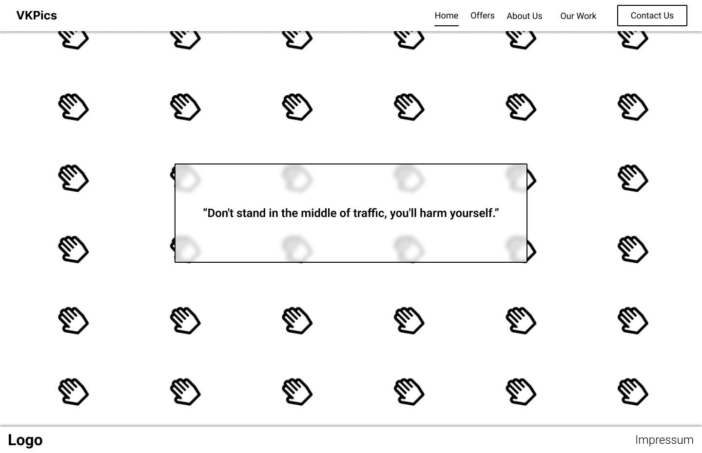
  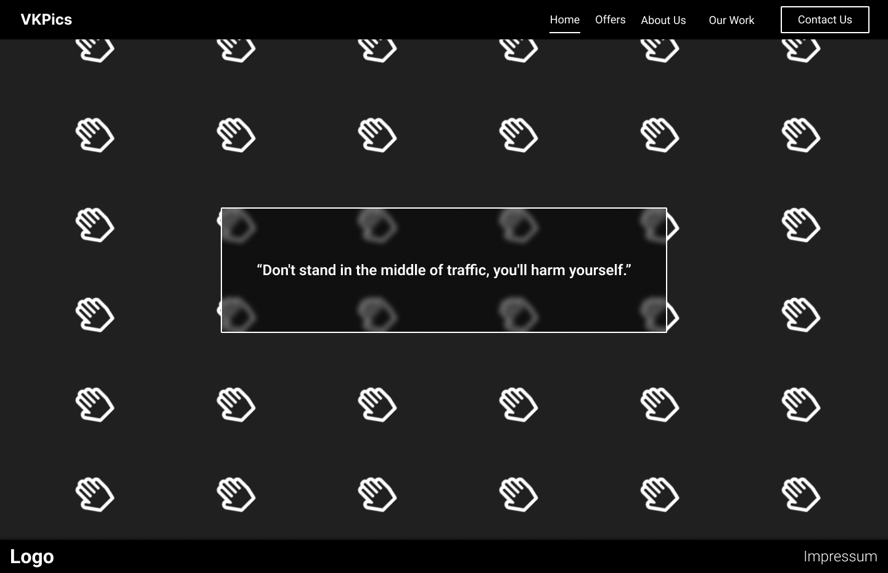
- Offers Page
  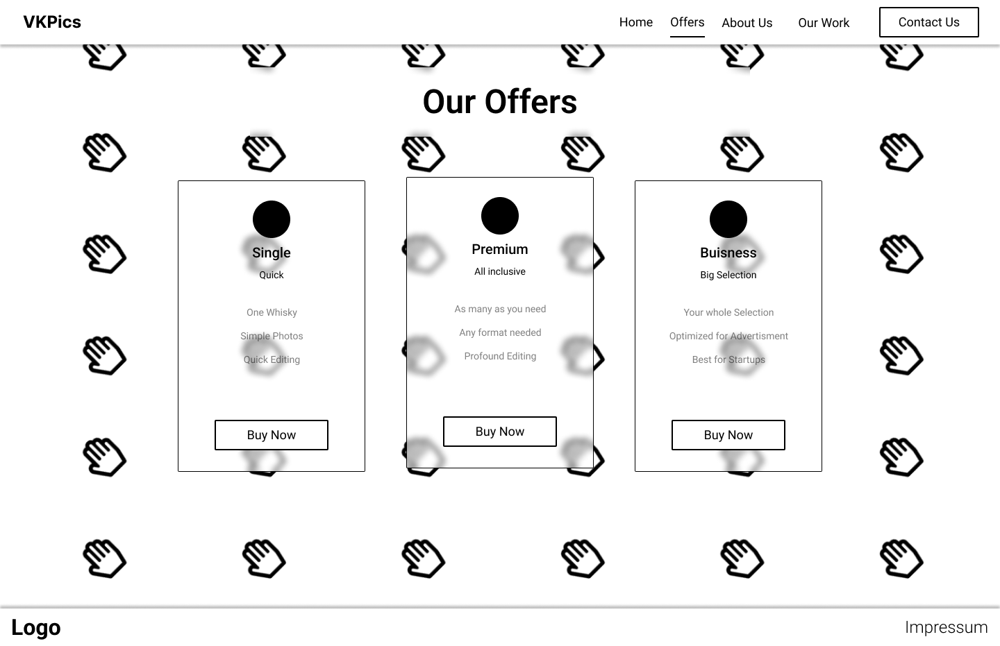
  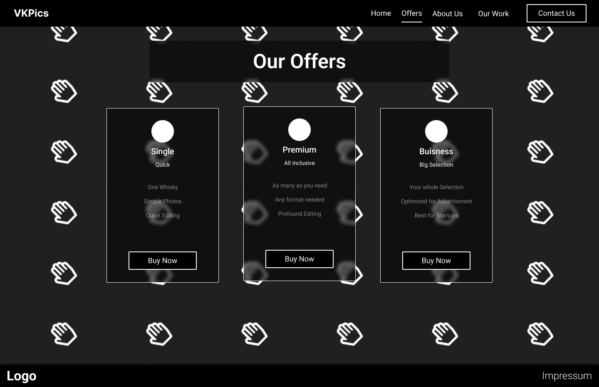
- Contact Page
  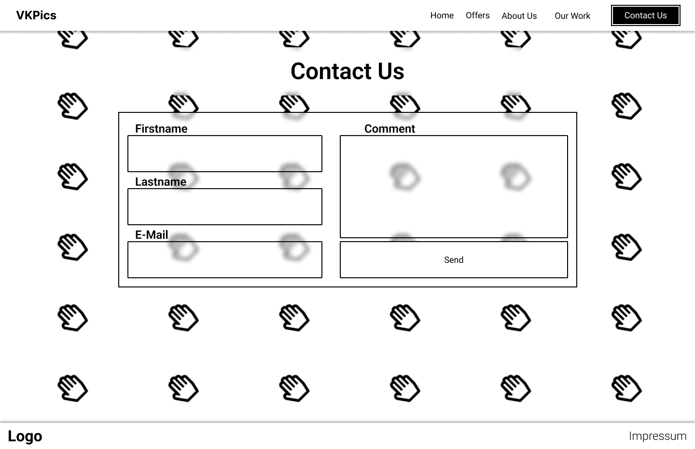
  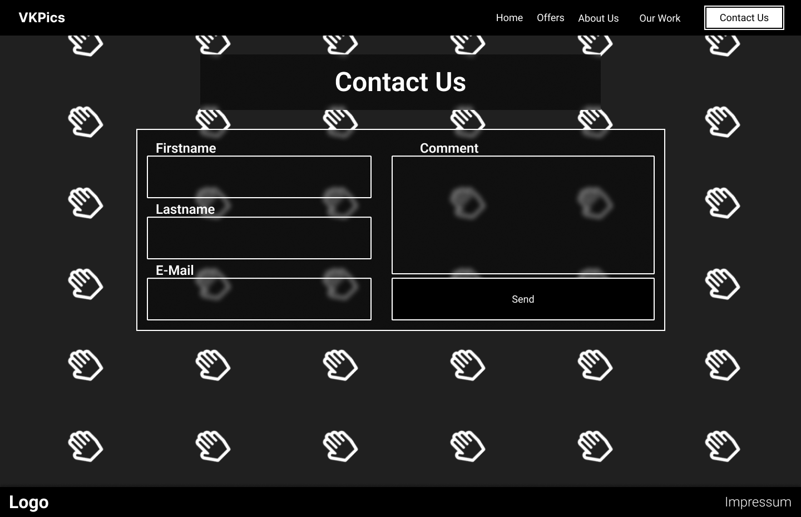
- About Page
  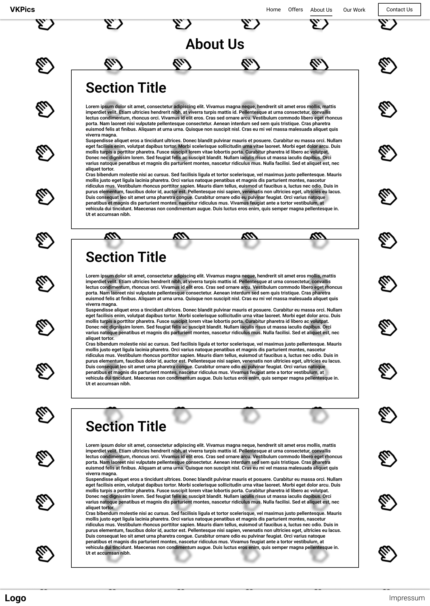
  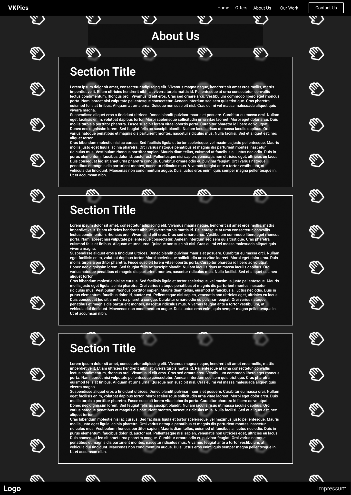
- Impressum
  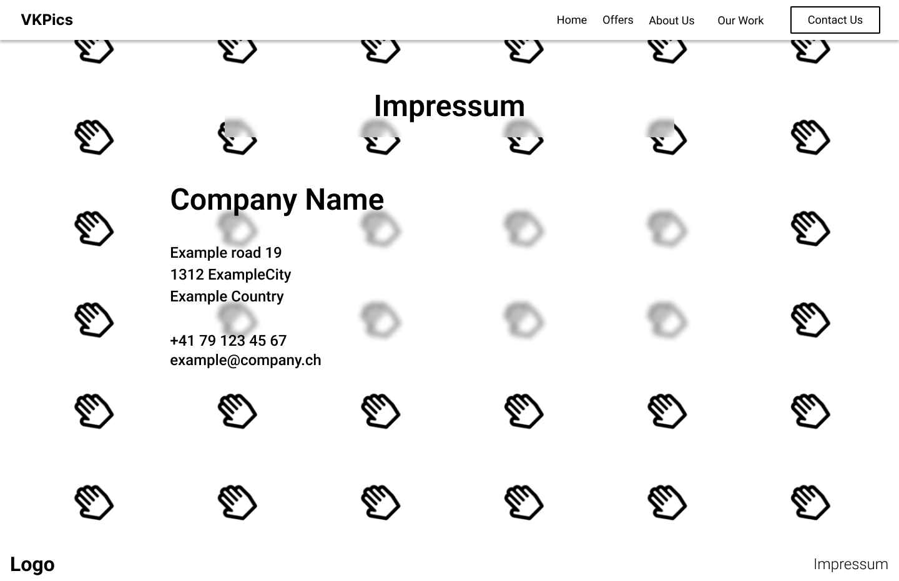
  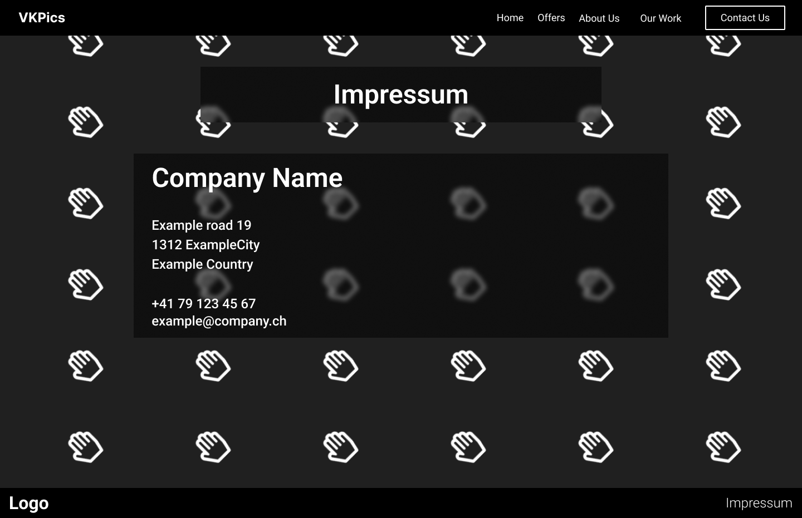
- Our Work Page
  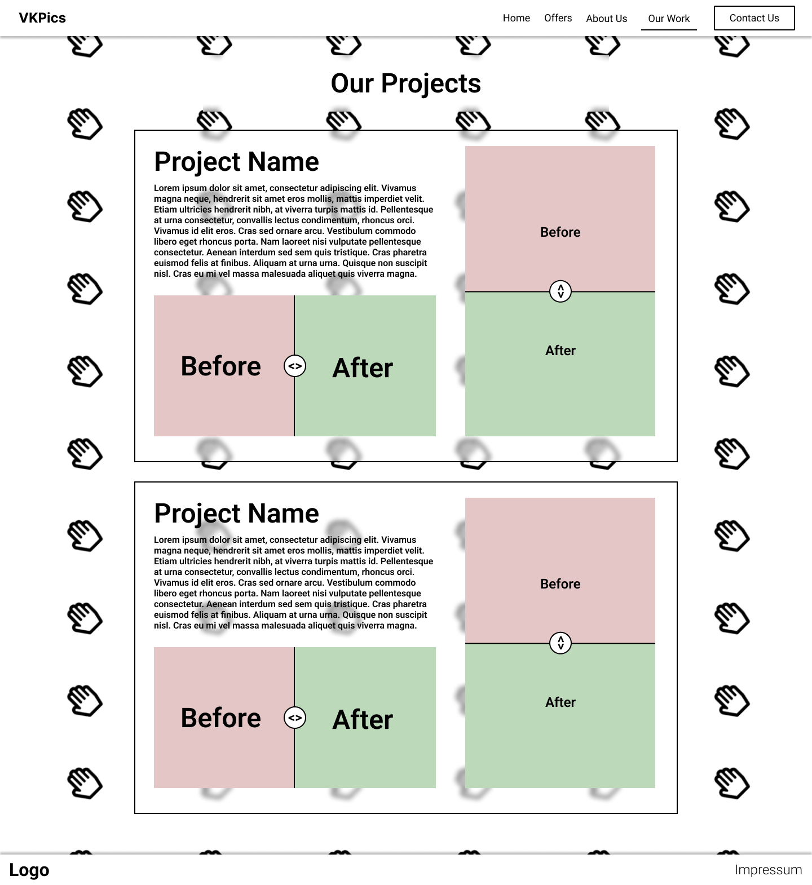
  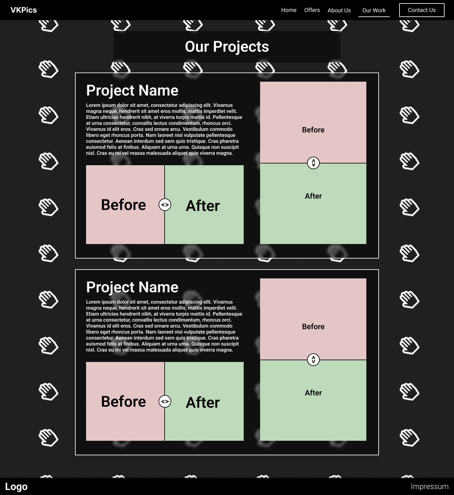
- Error Page
  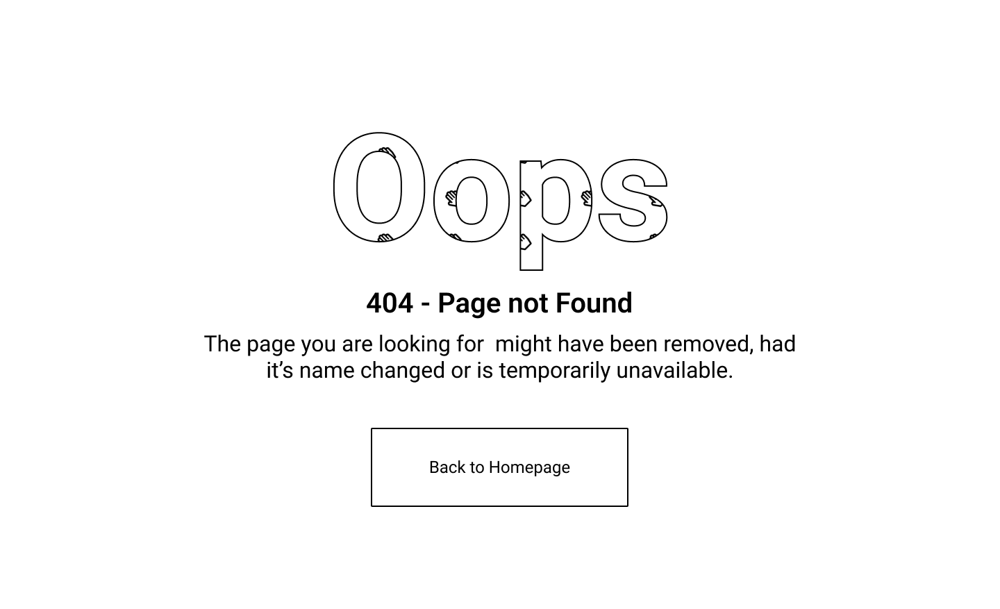
  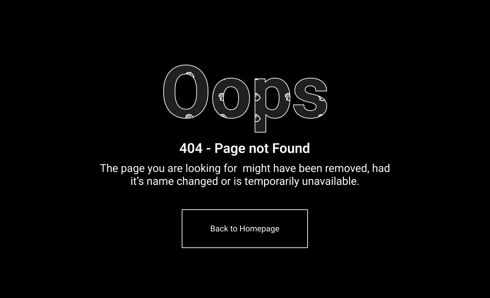

## Tools

### Image Editing

#### Choices:

- GIMP
- Adobe Photoshop
- Adobe Lightroom

#### Decision matrix:

| Criteria            | GIMP   | Adobe Photoshop | Adobe Lightroom |
| ------------------- | ------ | --------------- | --------------- |
|                     | Score  | Score           | Score           |
| Price               | 5      | 1               | 1               |
| Is it Downloaded?   | 1      | 5               | 1               |
| Can I use it?       | 2      | 4               | 1               |
| Functions           | 3      | 5               | 4               |
| Presets and filters | 3      | 5               | 5               |
| **Total**           | **14** | **20**          | **12**          |

What I chose: **Adobe Photoshop**

### Styling

#### Choices:

- CSS
- SCSS
- TailwindCSS

What I chose: **TailwindCSS**

### Icons

#### Choices:

- Font Awesome
- Material Design Icons
- Hero Icons

What I chose: **Font Awesome**
